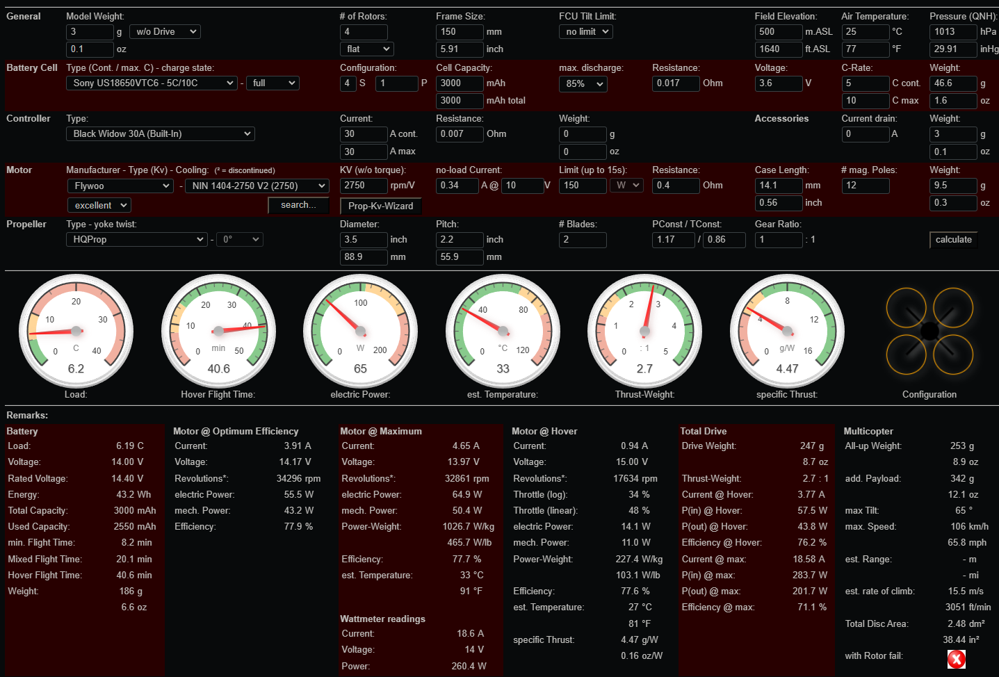

# vecihi
A light-weight autonomous UAV for mapping and localization

## Hardware

| Component         | Model                                       | Weight | Price   | Link                                                                                           | Notes                |
|-------------------|---------------------------------------------|--------|---------|------------------------------------------------------------------------------------------------|----------------------|
| Flight controller | MicoAir743 stack with 50A Bluejay 48kHz ESC | ~18g   | €99.11  | [Aliexpress](https://tr.aliexpress.com/item/1005006929914052.html?gatewayAdapt=glo2tur)        | 30x30mm installation |
| Motors            | 4x Lumenier ZIP V2 1404 2750kv              | 33.2g  | $67.96  | [GetFPV](https://www.getfpv.com/lumenier-zip-v2-1404-micro-cinematic-motor-2750kv-4600kv.html) | -                    |
| Propellers        | 4x HQProp 3.5x2.2x2                         | 4.4g   | $3.6    | [Elefun](https://www.elefun.se/p/prod.aspx?v=57852)                                            | -                    |
| Battery           | 4s 3000mAh - 18650 - Bronto Li-Ion XT60     | 204g   | $53.24  | [Elefun](https://www.elefun.se/p/prod.aspx?v=62485)                                            | -                    |
| Frame             | 3D printed 150mm whoop                      | ~50g   | -       | -                                                                                              | -                    |
| Total             |                                             | 310.6g | $224.91 |                                                                                                |                      |

The UAV has a flight time of 30-40 minutes with ~50g frame. The UAV is going to be designed for mapping and 3D localization with onboard sensors and computations. There can be an additional 100g payload with the sensors and additional processor. Our aim is to keep the UAV as light as possible to increase the flight time.

### Sample analysis of UAV dynamics

