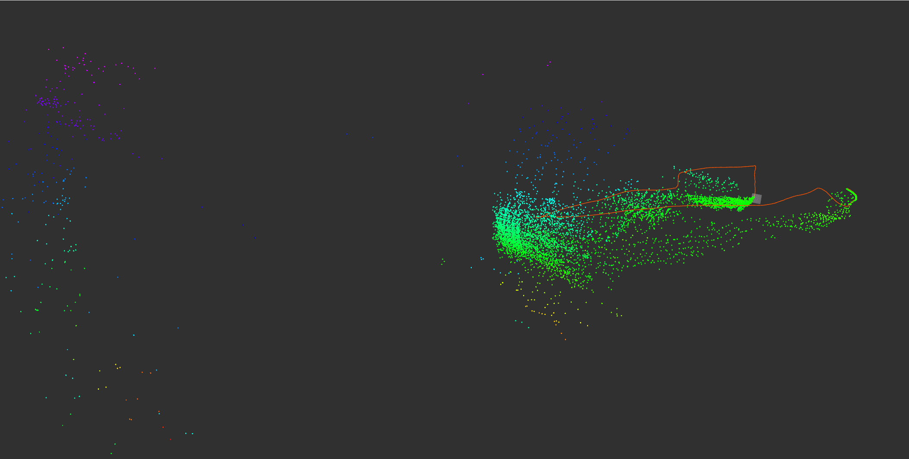

# PointCloud generation from sample flights with VL53L5CX sensor
This early SLAM code creates a point cloud from a flight of a UAV which is equipped with a VL53L5CX sensor. The collected
data includes VL53L5CX sensor, and UAV IMU data x,y,z, vx, vy, vz, pitch, roll and yaw values. Each flight data is stored
in a JSON file.

System designed as two nodes; ToF sensor node and SLAM node. ToF sensor node imitates the UAV and outputs ToF and pose 
data. ToF sensor node reads the sensor data from a sample JSON file and publishes the data to `tof` topic. SLAM node
subscribes to the `tof` topic and generates a point cloud from the sensor data. SLAM node publishes generated point cloud
to `pointcloud` topic as well as publishes pose and path data to relevant topics.

Then all generated data is visualized in Rviz with the configuration file `rviz-config/map-visualizer.rviz`.

Here a sample point cloud produced from A6 sample data:


## Installation

Install multipass to setup a virtual machine for ROS2

```bash
sudo snap install multipass
brew install multipass
```

Follow [guide](https://ubuntu.com/blog/ros-development-on-linux-windows-and-macos) to install ROS2 Humble blueprint (or newer versions of ROS2).

To use graphical interface of the virtual machine, install xquartz. Then setup ssh connection to the virtual machine with x11 forwarding:

```bash
multipass exec tof-vm -- bash -c "echo `cat ~/.ssh/id_rsa.pub` >> ~/.ssh/authorized_keys"
```

Establish ssh connection with x11 forwarding:
```bash
ssh -X ubuntu@xx.xx.xx.xx
```

Note: You can learn the ip address of the virtual machine with the command:

```bash 
multipass info tof-vm
```

### Install dependencies
#### Install serial library:

```bash
sudo apt install libboost-all-dev
``` 

> [!TIP]
> On windows follow [instructions](https://stackoverflow.com/a/70948703) to attach com port to WSL2.
You can list the ports in WSL2 with `ll /dev/tty*` command.**

#### Install robot localization package:

```bash
sudo apt install ros-iron-robot-localization
```

### Build the project

After installation run build command:

```bash
colcon build
```

Source the build:

```bash
source install/local_setup.sh
```

Run the nodes:
```bash
ros2 run tofSlam serial_listener
ros2 run robot_localization ekf_node --ros-args --params-file ./config/ekf.yaml
ros2 run tofSlam slamNode
ros2 run tofSlam tofNode
```

### Install foxglove for visualisation

Follow [guide](https://docs.foxglove.dev/docs/introduction) to install foxglove. And then install [foxglove-bridge](https://docs.foxglove.dev/docs/connecting-to-data/ros-foxglove-bridge).

Then run foxglove bridge and foxglove studio:

```bash
ros2 launch foxglove_bridge foxglove_bridge_launch.xml
foxglove-studio
```
